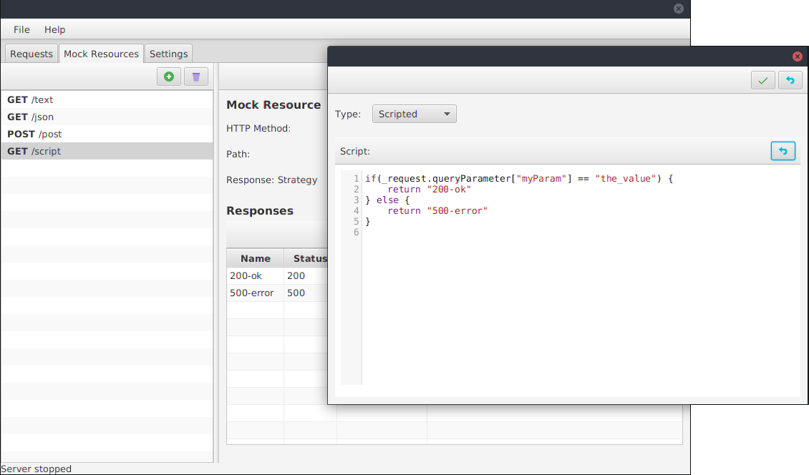

# REST UI 

REST UI is a simple application to test REST Clients.
With REST UI you can create mocked REST APIs and easily review the incoming requests.

## Features:

- Mock REST APIs
- Create custom responses for your mocked API
- Select between response strategies:
    - *Sequential*: Each request will be answered with the next response in sequential order
    - *Scripted*: Write a simple script that selects the appropriate response
- Inspect the incoming requests (HTTP headers and body)
- Supports HTTP and HTTPS
- Generate self signed certificates

## Screenshots:

| **Create mocked REST resources** | **Observe requests made to the mocked REST api** | **Select the response with a simple script** |
| --- | --- | --- |
|  |  |  |

## How to build
```
# Just run it
./gradlew run

# Build and run it
./gradlew build
cd build/distributions
unzip REST-UI-<version>.zip
./REST-UI-<version>/bin/REST-UI
```


## Technology & Architecture
This little project is an experiment for a new UI architectural style I never worked with before.
The architecture combines traditional MVVM with the ideas of Redux for unidirectional dataflow.

The UI is based on the awesome [TornadoFX](https://github.com/edvin/tornadofx) framework.

