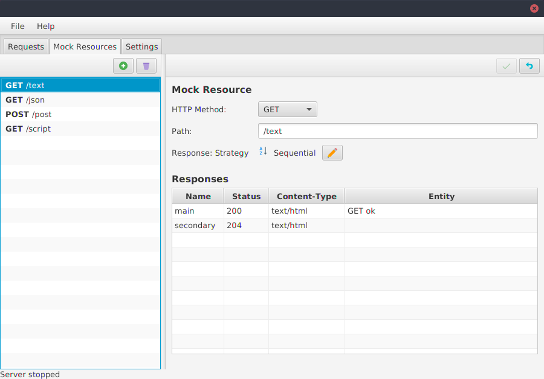
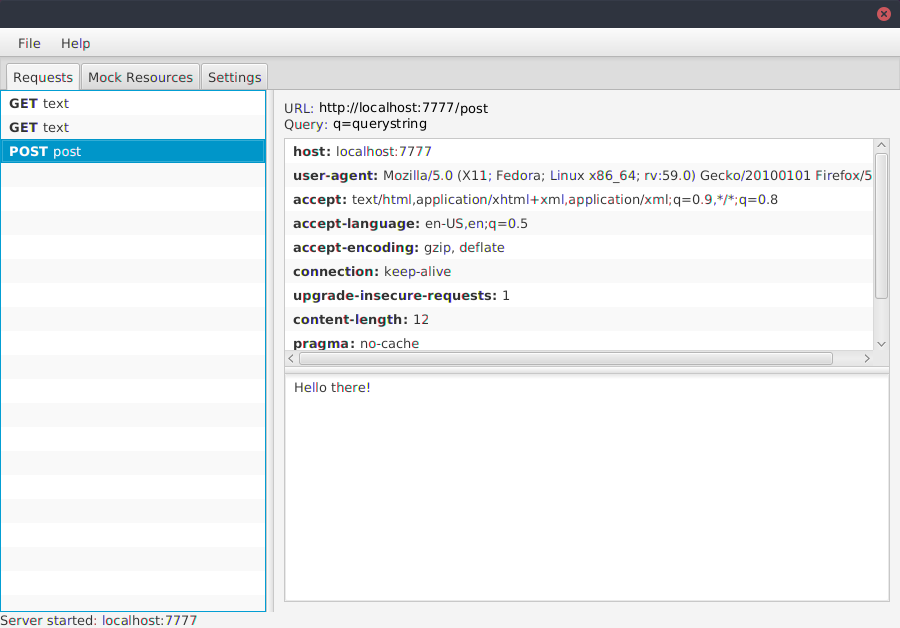

# REST UI 
> REST UI is "Work in Progress"

REST UI is a simple application to test REST Clients.
With REST UI you can create mocked REST APIs and easily review the incoming requests.

## Screenshots:

| **Create mocked REST resources** | **Observe requests made to the mocked REST api** |
| --- | --- |
|  |  |

## How to build
```
# Just run it
./gradlew run

# Build and run it
./gradlew build
cd build/distributions
unzip REST-UI-<version>.zip
./REST-UI-<version>/bin/REST-UI
```


## Technology & Architecture
This little project is an experiment for a new UI architectural style I never worked with before.
The architecture combines traditional MVVM with the ideas of Redux for unidirectional dataflow.

The UI is based on the awesome [TornadoFX](https://github.com/edvin/tornadofx) framework.

## Known Issues
- ~~**Application does not exit correctly:** This is a problem most likely due to an async server stop during application shutdown.~~
- **Docs:** KDoc is improvable.

## TODO:
- [x] Make it possible to add new mock responses
- [x] Implement save/load configuration
- [ ] Allow files as response entity
- [x] Add help for the scripted response strategy
- [ ] Allow HTTPS